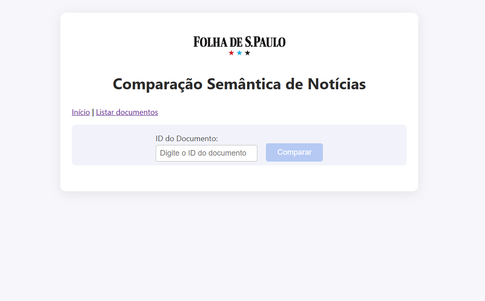
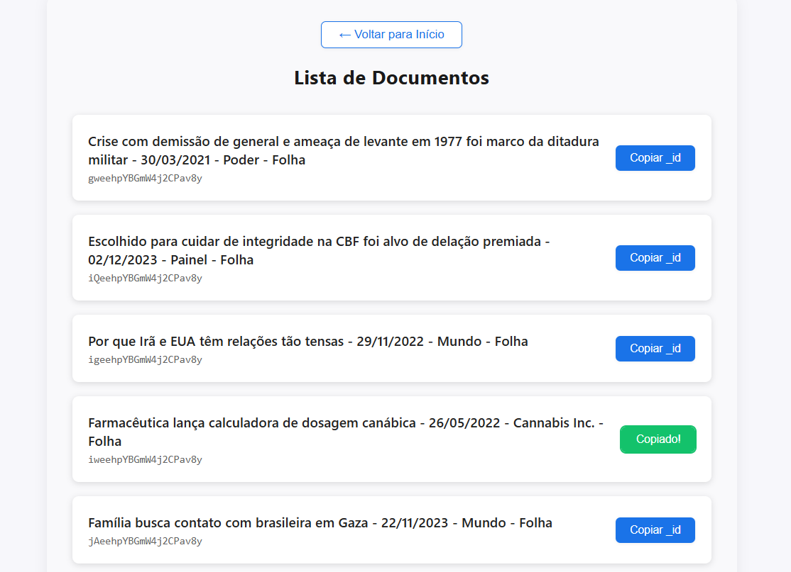

<p align="center">

</p>
<h2 align="center"><b>Comparação Semântica com Elasticsearch</b></h2>

<p align="center">
   <a>
      
   </a>
   <a>
      
   </a>
   <a>
      
   </a>
   <a>
      
   </a>
   <a>
      
   </a>
</p>

Este projeto é uma aplicação voltada para comparação semântica de notícias. 

Ele utiliza o modelo [`elastic/multilingual-e5-small`](https://huggingface.co/elastic/multilingual-e5-small) para geração de embeddings e o modelo [`Cohere/rerank-multilingual-v3.0`](https://huggingface.co/Cohere/rerank-multilingual-v3.0) para reranqueamento.

No backend, baseado em **FastAPI** e **Elasticsearch**, as buscas são realizadas por meio da [API](https://www.elastic.co/docs/solutions/search/retrievers-overview) `retriever`, combinando a **RRF (Reciprocal Rank Fusion)** com o `text_similarity_reranker`, permitindo a recuperação semântica dos documentos mais relevantes.

A aplicação compara uma notícia consultada com o restante da base e retorna os conteúdos mais similares. O frontend em **React** oferece uma interface simples e responsiva para navegação.

O objetivo do projeto é servir como modelo para casos de uso que envolvam comparação semântica em grandes volumes de dados, como:

- Recomendação de conteúdo
- Detecção de duplicidade ou plágio
- Agrupamento e navegação inteligente em bases de texto

## Estrutura do Projeto

```
semantic_comparison/
├── backend/     # FastAPI + Elasticsearch (busca semântica + rerank)
├── frontend/    # Aplicação React (interface web)
```

## Visão Geral

### Backend
Expõe endpoints REST para consulta e comparação semântica de notícias usando Elasticsearch, embeddings e rerank.

1. **Interface do FastAPI**: Possibilita a interação com o backend via interface web.


2. **Consulta de documentos**: Endpoint que retorna uma lista paginada de documentos.


3. **Comparação semântica**: Endpoint que compara documentos semânticamente com base em embeddings e rerank.


### Frontend
Interface web em React com navegação entre páginas (React Router), listagem paginada e estilizada de documentos e integração com o backend.

1. **Interface do React**: Interface web em React com listagem de documentos e comparação semântica.



2. **Consulta de documentos**: Página que lista documentos de forma paginada.



3. **Comparação semântica**: Página que compara documentos semânticamente com base em embeddings e rerank.


## Como Rodar Localmente

1. **Clone o repositório**
2. Siga as instruções específicas em:
   - [`backend/README.md`](./backend/README.md)
   - [`frontend/README.md`](./frontend/README.md)

## Requisitos Gerais
- Python 3.8+
- Node.js 18+
- Elasticsearch 8.15+

## Créditos
- Base de dados: [Kaggle - Folha News](https://www.kaggle.com/datasets/luisfcaldeira/folha-news-of-the-brazilian-newspaper-2024)

---

Consulte os READMEs de backend e frontend para detalhes de configuração, execução e arquitetura.

---

**Para atualizar seu repositório no GitHub:**
1. Faça commit de todas as alterações locais (`git add . && git commit -m "Atualizações frontend/backend e docs"`).
2. Faça push para o seu repositório remoto (`git push`).
